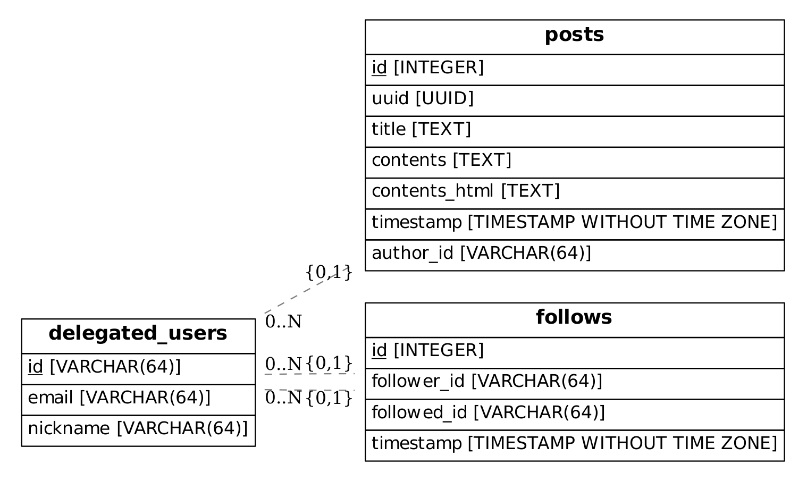
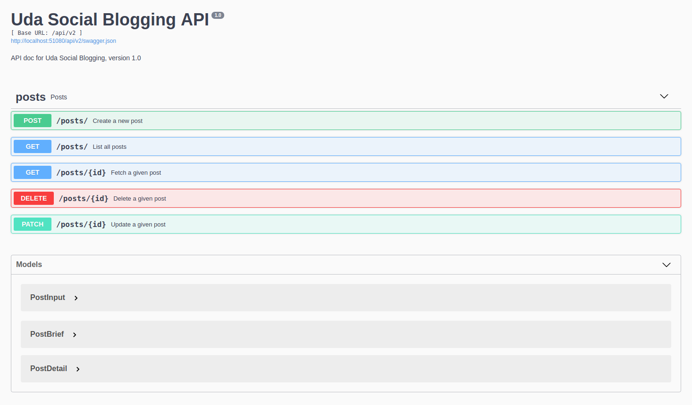
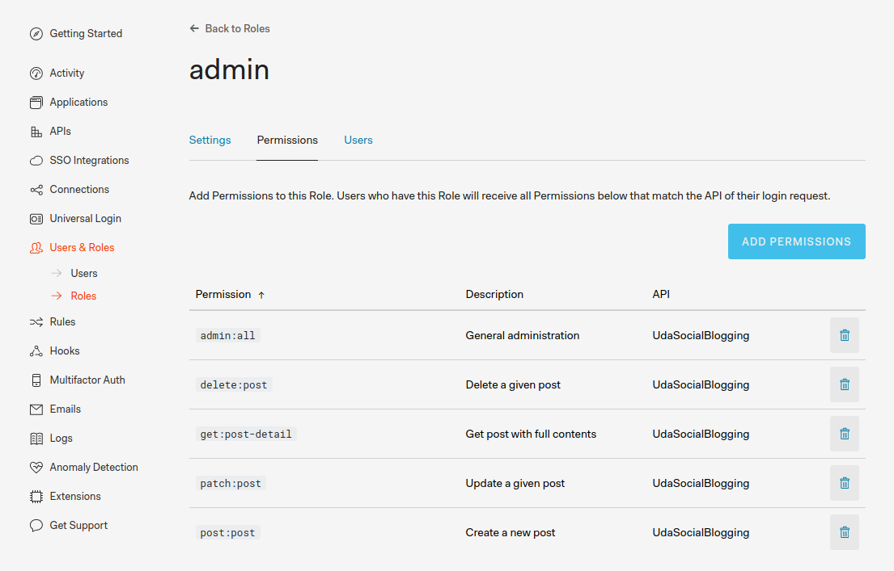
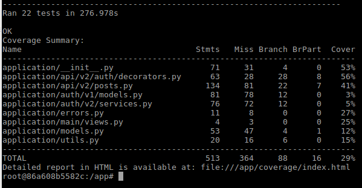
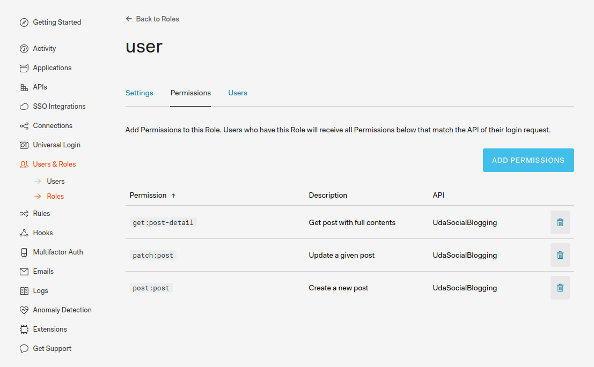
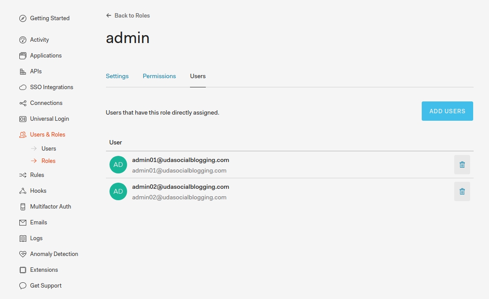
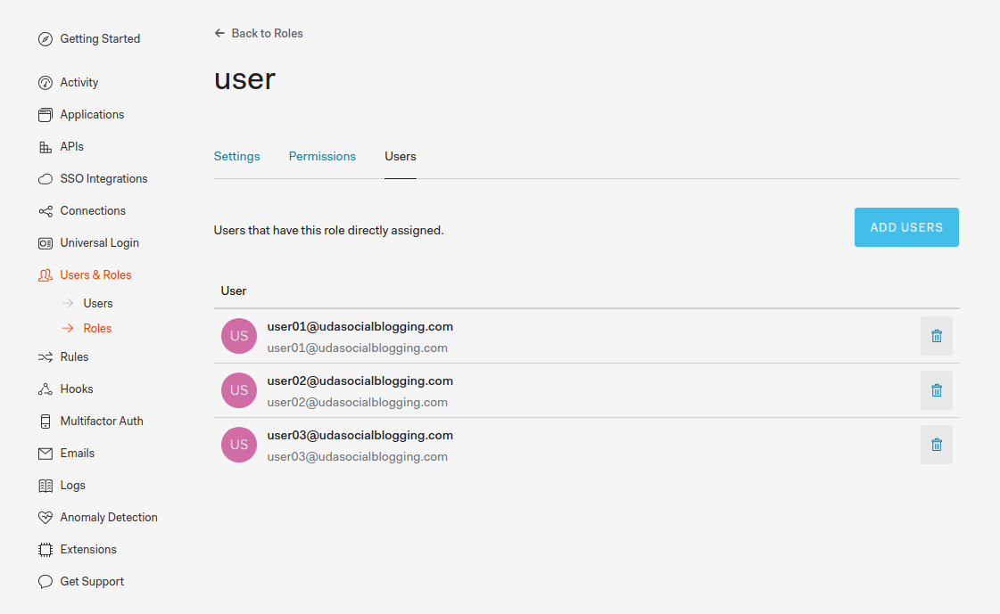
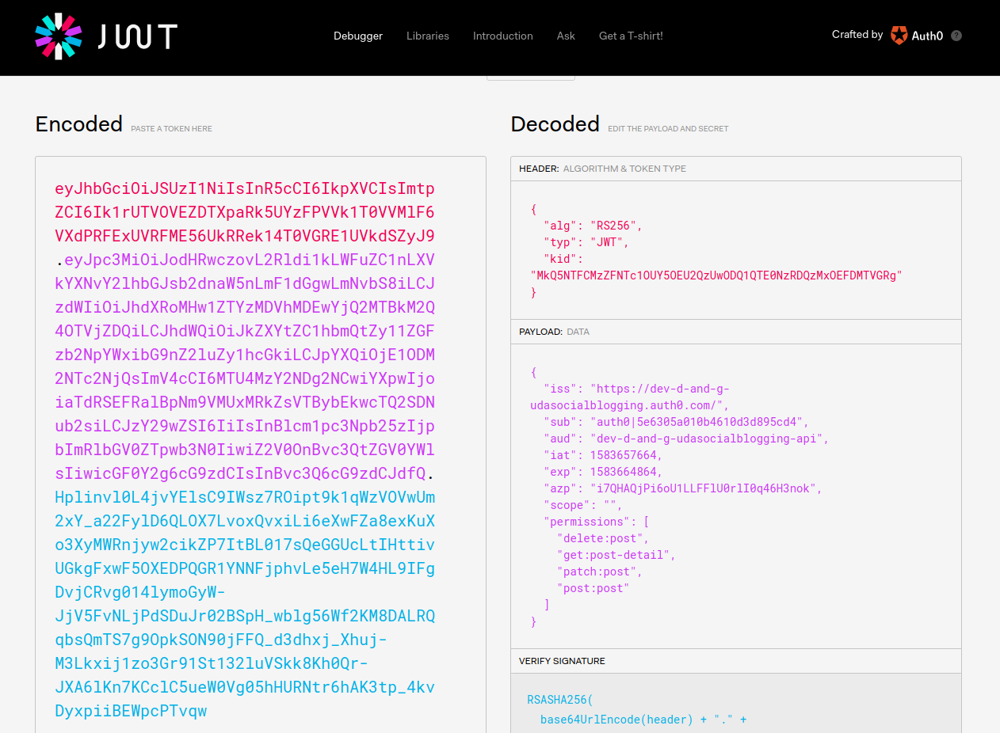

# Udacity Full Stack Development Nanodegree

This is the **capstone project** of Udacity's Full Stack Development Nanodegree

---

## Data Modeling

### Architect Relational Database Models in Python

Key data models are defined using SQLAlchemy in [here](workspace/backend/application/models.py)

Below is the ERD generated by [ERAlchemy](https://pypi.org/project/ERAlchemy/)

### Utilize SQLAlchemy to Conduct Database Queries

All database queries in this project is implemented using Python SQLAlchemy.

DB queries for resource posts can be found [here](workspace/backend/application/api/v2/posts.py)

---

## API Architecture and Testing

### Follow RESTful Principles of API Development

In this project all the RESTful endpoints are implemented using [Flask RESTplus](https://flask-restplus.readthedocs.io/en/stable/quickstart.html) inside [here](workspace/backend/application/api/v2)

### Structure Endpoints to Respond to Four HTTP methods with Error Handling

The interactive RESTful endpoints using [Swagger UI](https://flask-restplus.readthedocs.io/en/stable/swagger.html#swaggerui) can be accessed at [here](TBD)

Here is the overview of **posts** endpoints

#### Utilize the @app.errorhandler Decorator to Format error Responses as JSON Ojects for at least Four Different Status Codes

All error handlers are implemented inside [here](workspace/backend/application/api/v2/errors.py)

### Enable Role Based Authentication and Roles-Based Access Control (RBAC) in a Flask application

#### Project Implements a Custom @requires_auth Decorator

The custom @requires_auth decorator, which implementes
    * Authentication
    * Authorization
can be found [here](workspace/backend/application/api/v2/auth/decorators.py)

#### Project Includes at least Two Different Roles that Have Distinct Permissions for Actions

The two roles defined in this project are as follows:

First role is **admin**, which can perform all actions on posts.

Second role is **user**, which can perform all actions except delete on posts.

### Demonstrate Validity of API Behavior

All the 5 endpoints are fully tested, each with
    * At least one test for expected success and error behavior
    * All the 2 roles plus non-login situation.
The test case implementations can be found [here](workspace/backend/tests)

The test coverage analysis is as below

The coverage rate is limited due to the implementation nature of Flask RESTPlus.

---

## Third-Party Authentication

### Configure Third-Party Authentication Systems

The Auth0 Domain Name, Client ID and the two JWT code signing secrets are available at [here](workspace/backend/config.py)

### Configure Roles-Based Access Control (RBAC)

#### Roles and Permission Tables are Configured in Auth0

The two roles defined in this project are as follows:

First role is **admin**, which can perform all actions on posts.

Second role is **user**, which can perform all actions except delete on posts.

#### Access of Roles is Limited. Includes at least Two Different Roles with Different Permissions

Below is the association between roles and accounts in this project

#### The JWT Includes the RBAC Permission Claims

The generated JWT can be analyzed in the [JWT Online Debugger](https://jwt.io/)

Here is one example of decoded JWT payload, which contains the permissions field.

---

## Deployment

### Application is Hosted Live at Student Provided URL

The APP is hosted on Heroku at [D & G Services Uda Social Blogging](https://d-and-g-uda-social-blogging.herokuapp.com/)

The API is available as Swagger UI at [D & G Services Uda Social Blogging APIs](https://d-and-g-uda-social-blogging.herokuapp.com/api/v2/)

Please follow the instructions below to play around with the APIs.

### Includes Instructions to Set Up Authentication

First, get the required JWT for Authorization header at [here](https://d-and-g-uda-social-blogging.herokuapp.com/)

Copy this token for API debugging

After that, all the APIs can be tested interactively inside [Swagger UI](https://flask-restplus.readthedocs.io/en/stable/swagger.html#swaggerui). Please interact with the APIs [here](https://d-and-g-uda-social-blogging.herokuapp.com/api/v2/). Below is one example for **create new post**.

---

## Code Quality & Documentation

### Write Clear, Concise and Well Documented Code

All the core functionalities follows recommended coding practices plus ample comment for understanding.

### Project Demonstrates Reliability and Testability

The backend is deployed for production using the following best practices:

* One
* Two
* Three

### Project Demonstrates Maintainability

The project has been structured according to [Miguel Grinberg](https://blog.miguelgrinberg.com/post/the-flask-mega-tutorial-part-xv-a-better-application-structure)'s recommended best practices.

### Project Includes Thorough Documentation

The project has been well documented both for local and on Heroku evaluation.

