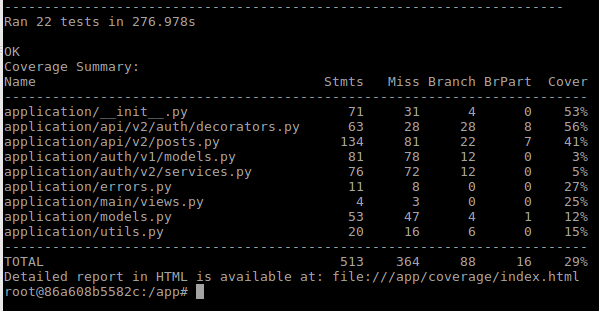

# Uda Social Blogging

This the **Capstone Project** of Udacity's Full Stack Development Nanodegree, Uda Social Blogging

---

### Backend

The `./backend` directory contains a full fledged Flask backend for Uda Social Blogging. It supports Auth0 hosted account management and RBAC. Besides, it also gives accesses to two resources: posts and follows, in both MVC and RESTful ways.

[View the README.md within ./backend for further details.](./backend/README.md)

--- 

## Up & Running

### Build Images

The building of frontend would take some time because of npm install. Grab a coffee and have a break before you continue!

```bash
docker-compose build
```

### Initialize Database

#### Identify Backend Instance

First, identify backend instance by typing the following command. Select the one whose name contains **backend**

```bash
docker ps -a
```


#### Restore Database

Then, enter the instance and initialize DB data by typing:

```bash
# enter backend instance:
docker exec -it workspace_backend_1_85589b31fcfe bash
# init db:
flask init-db-v2
```

### Check Host Ports

Make sure the following ports are not used on local host:
* **localhost:51080** This port will be used by backend for MVC access
* **localhost:58080** This port will be used by PG adminer for easy database administration

### Launch

Launch the system using docker-compose. Note: 

* The backend will communicate with PGSQL DB using docker compose internal network

```bash
docker-compose up
```

---

## API Endpoints


---

## Testing

### Overview

All the 5 API endpoints are covered by test cases. For the drinks resource, the coverage rate is 86%. See [Python Unittest Testcases](workspace/backend/tests) and [POSTman Testcases](workspace/backend/tests/postman) for details.

### Python Unittest Up & Running

First, identify backend instance by typing the following command. Select the one whose name contains **backend**

```bash
docker ps -a
```


Then, enter the instance and execute the tests by typing:

```bash
# enter backend instance:
docker exec -it workspace_backend_1_85589b31fcfe bash
# run tests:
flask test
```

Test coverage analysis is also enabled. Use the following command to get the coverage analysis report:
```bash
# inside backend instance, type:
flask test --coverage=True
```



### POSTman Testcases Up & Running

The test runner and the results for the three roles(public, barista and manager) are all kept in [POSTman Testcases](workspace/backend/tests/postman)
